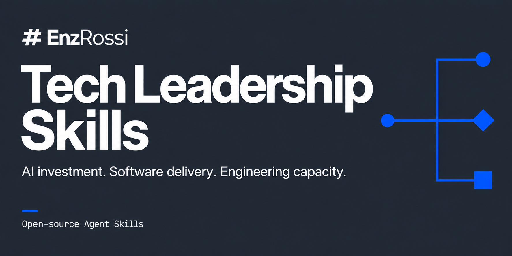

# EnzRossi Tech Leadership Skills



Open-source Agent Skills for technology leaders making software, delivery, resourcing, AI and new-idea decisions.

[Explore the project website and installation guide](https://enzrossi.github.io/tech-leadership-skills/).

Five workflows for turning incomplete evidence into a decision memo: whether an AI initiative deserves investment, whether a project needs intervention, how to obtain an engineering capability, when an agent-assisted project can realistically ship, and whether a product or internal-tool idea deserves the next commitment.

[](https://github.com/EnzRossi/tech-leadership-skills/actions/workflows/validate-skills.yml)
[](LICENSE)

For CTOs, VPs and Directors of Engineering, technical founders, Product leaders and Engineering Managers. Bring the evidence you have; each workflow produces an initial assessment and identifies a few missing facts that could change it.

## The skills

| Skill | Use it when | What it adds |
|---|---|---|
| [AI Initiative Evaluator](skills/ai-initiative-evaluator/SKILL.md) | A demo, executive mandate or pilot needs an investment decision | Compare the strongest non-AI alternative; test data and evaluation readiness; define evidence needed for prototype, pilot or rollout |
| [Software Project Health Review](skills/software-project-health-review/SKILL.md) | Status reports and delivery evidence disagree | Trace threats to a dated commitment; distinguish missing evidence from poor health; identify the intervention that can affect delivery |
| [Build / Buy / Hire / Augment](skills/build-buy-hire-augment/SKILL.md) | A capability needs a sourcing decision | Separate solution from delivery and long-term ownership; compare internal, product, partner and hybrid options on the same terms |
| [Agentic Project Estimation](skills/agentic-project-estimation/SKILL.md) | A software estimate needs to reflect coding agents, team capacity and company constraints | Compare staffing scenarios using accepted work, review/testing effort and release dependencies; assess deadline and project viability |
| [Idea Validation](skills/idea-validation/SKILL.md) | A product, startup, feature or internal-tool idea needs an honest go, test, reshape or stop answer | Ask the questions that change the verdict; check alternatives, market and geography, buyer and route, copyability, AI fit and cost drivers; propose the cheapest test that could kill or confirm the idea |

Default output: a short memo, usually 250–600 words (350–700 for an estimation comparison or a full idea validation), with 100–250 often enough for a narrow question, with the recommendation first and deeper evidence only when useful. These workflows can conclude that no AI, no intervention, no outside help, or no new product is warranted. They can also support proceeding when evidence justifies it.

## What is an Agent Skill?

A skill is a folder containing `SKILL.md` instructions and optional references. A supporting agent reads the description to decide when to load the workflow, then consults reference material as needed. It does not install a model, connect your systems, or run a service. See the [Agent Skills format](https://agentskills.io/specification).

These skills supply review procedures and evidence checks. They do not establish facts your materials cannot support or replace accountable human decisions.

## Install and try one

Clone the repository and copy a complete skill folder, including references and assets. The following examples install only the AI evaluator; substitute another skill name as needed. Check for an existing folder before copying an update.

```bash
git clone https://github.com/EnzRossi/tech-leadership-skills.git
```

**Codex, personal installation:**

```bash
mkdir -p ~/.agents/skills
cp -R tech-leadership-skills/skills/ai-initiative-evaluator ~/.agents/skills/
```

**Claude Code, personal installation:**

```bash
mkdir -p ~/.claude/skills
cp -R tech-leadership-skills/skills/ai-initiative-evaluator ~/.claude/skills/
```

For a shared project, use its `.agents/skills/` (Codex) or `.claude/skills/` (Claude Code). Reload or start a new agent session as your client requires. Ask it to use `ai-initiative-evaluator` and verify that it reads the skill. Explicit loading is useful when automatic discovery has not been tested in your client.

[Compatibility](docs/compatibility.md) separates documented support, explicit workflow execution and tested automatic activation. No claim is made that these work in every agent.

## Example requests

> Our claims team proposes an LLM to triage 3,000 emails a week. We have historical assignments but haven't inspected the original attachments or consulted adjusters. Use ai-initiative-evaluator to recommend the next commitment and how to judge it.

> Use software-project-health-review on this tracker export and three steering reports. Status stayed green while launch moved. Assess the commitment as of these records and identify the decisions for Thursday.

> We need multi-country payouts in five months. Our team is occupied, hiring takes four to six months, and banking data has access constraints. Use build-buy-hire-augment to compare buying rails, internal integration and outside expertise.

> Use agentic-project-estimation to estimate this customer portal for one, two and four engineers using coding agents. We have an existing platform, one part-time reviewer and a fixed security-review window. Compare accepted delivery dates, not just coding effort.

> I want to build a scheduling tool for private ambulance operators in Germany. Six operators signed paid pilots and the incumbent desktop tool is unmaintained. Use idea-validation to tell me honestly whether to commit two engineers for a quarter and what would change that answer.

The [scenario fixtures](skills/software-project-health-review/evals/files/steering-notes.md) are fictional. Use material permitted in your agent environment; the skills do not require uploading it to another service.

## Evidence of usefulness

The tests target errors that make advice unusable: inventing costs, confusing a missing PR link with missing tests, accepting a biased vendor pitch, or declaring an AI pilot safe from a small reused test set.

See [evaluation results and limitations](docs/eval-results.md) for retained outputs, failures and what has not been measured. Structural validation, scenario quality and actual skill triggering are different checks. The current evaluation is a limited development comparison, not proof of reliable improvement across models or real organizations.

The [landscape review](docs/landscape.md) acknowledges overlapping work. Our intended contribution is the specific decision procedure and its tested failure cases, not a claim to have invented evidence-based leadership.

## Contribute

Read [CONTRIBUTING.md](CONTRIBUTING.md) and [project principles](docs/principles.md). Add a realistic failure case before adding another framework. Use [the skill template](templates/skill-template/SKILL.md) for new workflows within technology leadership.

```bash
python3 -m venv .venv
.venv/bin/pip install -r scripts/requirements-validation.txt
.venv/bin/python scripts/validate_skills.py --require-reference
.venv/bin/python -m unittest discover -s scripts -p 'test_*.py'
```

The validator checks packaging, references and eval fixtures; it does not run model evaluations. See [the final review report](docs/review-report.md) for release concerns and ranked future skills.

## License and publisher

[Apache-2.0](LICENSE). Copyright 2026 EnzRossi. Sources and borrowed concepts are attributed in each skill's `references/sources.md`.

[EnzRossi](https://enzrossi.com) provides software engineering services. This commercial interest is why the sourcing skill requires equal evidence standards for internal and external options. No skill directs the user to hire EnzRossi.
